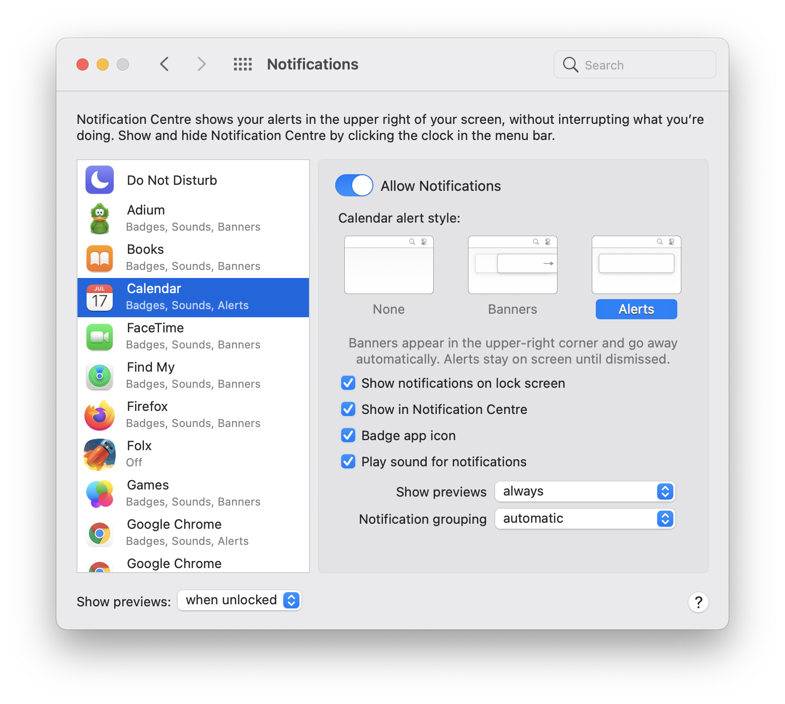

# Настройка уведомлений macOS

В `macOS` есть уведомления двух типов - `banner` и `alert`.

Уведомления типа `alert` не скрываются, ожидая действия пользователя. А уведомления типа `banner` скрываются с настройками по умолчанию после пяти секунд.

Выбрать тип уведомления для конкретного приложения можно в настройках

<div align="center">



</div>

## Настройка времени отображения уведомлений типа banner

Изменить время отображения уведомлений типа `banner` можно указанием параметра `com.apple.notificationcenterui` с помощью команды `default`.

Например, для установки времени отображения в течение 30 секунд в `macOS` `Mojave` и `Catalina` это делается следующей командой:

```c
defaults write com.apple.notificationcenterui bannerTime -int 30
```

Для `macOS` `Sierra`, `El Capitan`, `Yosemite` и более ранних указывать, что параметр имеет целочисленный тип (`-int`) не нужно:

```c
defaults write com.apple.notificationcenterui bannerTime 30
```

[https://www.addictivetips.com/mac-os/change-banner-notification-dismiss-time-on-macos](https://www.addictivetips.com/mac-os/change-banner-notification-dismiss-time-on-macos/)\
[https://osxdaily.com/2014/01/29/change-notifications-banner-time-mac-os-x](https://osxdaily.com/2014/01/29/change-notifications-banner-time-mac-os-x/)
